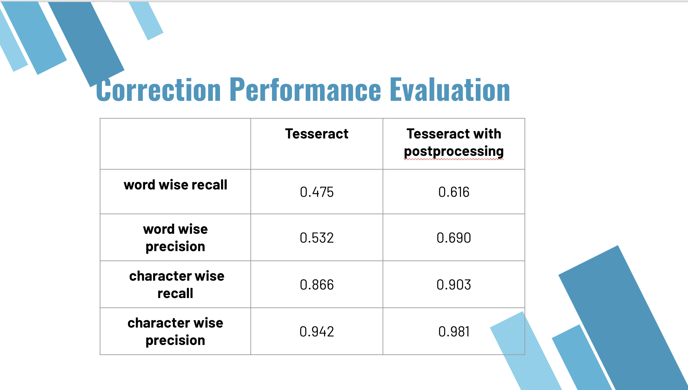

# Project: OCR (Optical Character Recognition) 


### [Full Project Description](doc/project4_desc.md)

Term: Fall 2018

+ Team #
+ Team members
	+ Ma, Yunsheng (ym2650@columbia.edu)
	+ Namboothiri, Deepika (dsn2127@columbia.edu)
	+ Wang, Yaxin (yw3042@columbia.edu)
	+ Zhang, Rui (rz2406@columbia.edu)
	+ Zhao, Lingyi (lz2570@columbia.edu)

+ Project summary: In this project, we created an OCR post-processing procedure to enhance Tesseract OCR output. We deal with detection and correction based on paper D2 and paper C2 in the doc folder. For detection, we give error detection list of all words, indicating each of them is correct or wrong. For correction, we use five features for Random Forest model then give final model for error's correct candidate. 



```

	
**Contribution statement**: ([default](doc/a_note_on_contributions.md)) 

	Wang, Yaxin: Responsible for dictionaries construction part of paper D2.
	Ma, Yunsheng: Responsible for the detection and evaluation part of paper D2. 
	Namboothiri, Deepika: Responsible for the trainsition between paper D2 and C2. Also, she wrote Lexion existance feature scoring and given final changed txt.  
	Zhang, Rui: Responsibility for paper C2. She wrote String Similarity feature scoring and discussed as well as wrote random forest model with Lingyi Zhao. 
	Zhao, Lingyi: Repsonsibility for paper C2. She wrote Candidate dictionary, candidate search, Levenshtein edit distance, Exact-context popularity parts and wrote random forest model with Rui Zhang. 
We split our work evenly
Following [suggestions](http://nicercode.github.io/blog/2013-04-05-projects/) by [RICH FITZJOHN](http://nicercode.github.io/about/#Team) (@richfitz). This folder is orgarnized as follows.

```
proj/
lib/The lib folder contain computation codes for your data analysis.
data/The data folder contains the raw data of this project. It contians 100 error-files and 100 corresponding ground truth files. 
doc/The doc folder contains main(detection).ipynb,main(correction).rmd and their corresponding .html files. It also contians the final testing report.
figs/The figs folder contains figure files produced during the project and running of the codes.
output/The output folder contains intermediate and final computational results, which include combined and cleaned trainning and testing data files, comerror-detection list from the detection part and the corrected test file.


Please see each subfolder for a README file.
