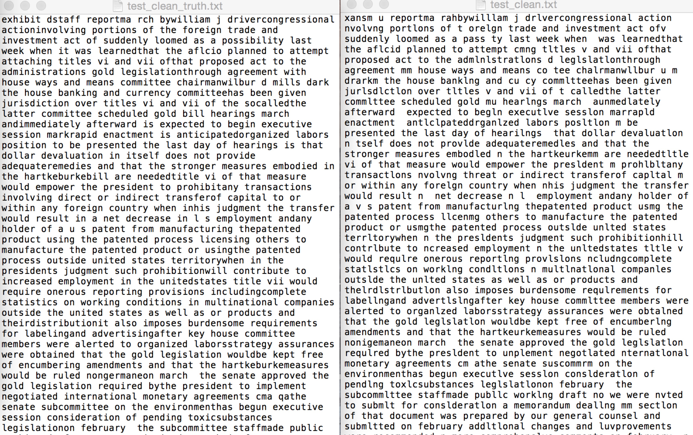

# Project: OCR (Optical Character Recognition) 




### [Full Project Description](doc/project4_desc.md)

Term: Fall 2018

+ Team #
+ Team members
	+ Ma, Yunsheng (ym2650@columbia.edu)
	+ Namboothiri, Deepika (dsn2127@columbia.edu)
	+ Wang, Yaxin (yw3042@columbia.edu)
	+ Zhang, Rui (rz2406@columbia.edu)
	+ Zhao, Lingyi (lz2570@columbia.edu)

+ Project summary: In this project, we created an OCR post-processing procedure to enhance Tesseract OCR output. We deal with detection based on paper D2 and correction based on paper C2. For detection, we will give final list of all words are correct or error. For correction, we use five features for Random Forest model then give final model of error's correct candidate. 
	
**Contribution statement**: ([default](doc/a_note_on_contributions.md)) 
Ma, Yunsheng: Responsibility for paper D2. 
Namboothiri, Deepika: Responsibility for paper D2. She wrote Lexion existance feature scoring and given final changed txt.  
Wang, Yaxin: Responsibility for paper D2.
Zhang, Rui: Responsibility for paper C2. She wrote String Similarity feature scoring and discussed as well as wrote random forest model with Lingyi Zhao. 
Zhao, Lingyi: Repsonsibility for paper C2. She wrote Candidate dictionary, candidate search, Levenshtein edit distance, Exact-context popularity parts and wrote random forest model with Rui Zhang. 

Following [suggestions](http://nicercode.github.io/blog/2013-04-05-projects/) by [RICH FITZJOHN](http://nicercode.github.io/about/#Team) (@richfitz). This folder is orgarnized as follows.

```
proj/
????????? lib/
????????? data/
????????? doc/
????????? figs/
????????? output/
```

Please see each subfolder for a README file.
